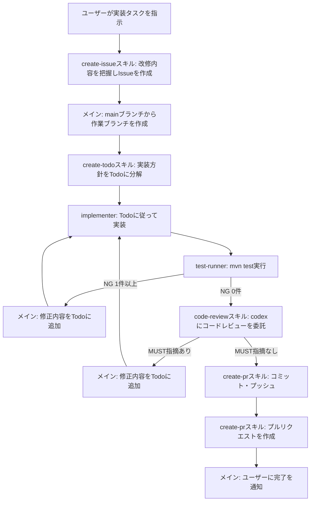

# 開発フロー

## 基本方針

- ユーザーから実装タスクを指示された場合は、本ルールのフローに従って進める
- メインエージェントは**オーケストレーターに徹する**。実装・テスト実行は専任のサブエージェントに、コードレビューはcodex CLI（ヘッドレスモード）に委任する
- 実装方針および進捗はTodoで管理し、サブエージェントにはTodoに記載された方針を忠実に守らせる
- レビュー指摘（MUST）・テストNGが残っている状態で、コミットやプルリクエストの作成に進まない
- Issue作成・ブランチ作成・コミット・プッシュ・プルリクエスト作成は、本フローの一部として**都度の確認なしに実行してよい**（本ルールをもって事前承認とする）。ただしmainブランチへの直接コミット・プッシュ、および強制プッシュは行わない

## フロー図

## 各ステップの詳細

| # | ステップ | 担当 | やること |
| --- | --- | --- | --- |
| 1 | Issue作成 | メインエージェント | `create-issue`スキルを使用し、ユーザーの指示から改修内容を整理してIssueを作成する。作成したIssue番号を以降のステップで使用する |
| 2 | 作業ブランチ作成 | メインエージェント | `git switch main && git pull`で最新化した上で、`git switch -c <ブランチ名>`により作業ブランチを作成する。ブランチ名は後述の命名規則に従う |
| 3 | 方針のTodo化 | メインエージェント | `create-todo`スキルを使用し、実装方針を作業工程単位のTodoリストに分解して`.claude/todo/issue-{Issue番号}.md`に出力する。この時点で`.claude/rules`配下の各ルールを満たす方針になっているかを確認する |
| 4 | 実装 | `implementer`サブエージェント | Todoに記載された方針のみを実装する。方針外の追加実装・リファクタリングはしない。完了した項目はTodoファイルのチェックボックスを`- [x]`に更新する。メインエージェントは呼び出し時に**Todoファイルのパスを必ず伝える** |
| 5 | テスト実行 | `test-runner`サブエージェント | `mvn test`を実行し、JUnitの件数サマリーとCheckstyle違反件数のみを返す。コードレビューより先に実行することで、動作しないコードをレビューに回さない |
| 6 | テストNGの修正 | メイン → `implementer` | 詳細ログ（`target/test-results/mvn-test-output.log`）を確認して原因を特定し、未チェック項目としてTodoファイルに追記して`implementer`に修正を依頼する。修正後は#5のテストからやり直す |
| 7 | コードレビュー | メインエージェント （codex CLI） | `code-review`スキルを使用し、`codex exec`（ヘッドレスモード）にレビューを委託する。codexは未コミットの変更をプロジェクト独自の10観点でレビューし、MUST/SHOULD/WANTに分類した全指摘を`target/code-review-result.md`へ出力する。メインエージェントは同ファイルを読んでMUSTの有無を判断する。codexは`-s read-only`で起動するため修正は行わない |
| 8 | 指摘の修正 | メイン → `implementer` | **MUST**の指摘は必ず修正する。指摘内容と修正方針を未チェック項目としてTodoファイルに追記し、`implementer`に修正を依頼する。修正後は必ず#5のテストからやり直す。SHOULD/WANTは修正せず、#10の完了通知でユーザーに提示して判断を仰ぐ |
| 9 | コミット・プッシュ・ プルリクエスト作成 | メインエージェント | `create-pr`スキルを使用し、コミット・プッシュとmainブランチ向けのプルリクエスト作成をまとめて行う。JUnitのNG件数とCheckstyle違反件数がいずれも0件であることが前提条件となる |
| 10 | 完了通知 | メインエージェント | 実装内容・テスト結果・プルリクエストのURLをユーザーに簡潔に報告する。未対応のSHOULD/WANT指摘がある場合は、あわせて提示する |

## ブランチ命名規則

`<type>/#<Issue番号>-<英語ケバブケースの概要>`の形式とする。`<type>`はConventional Commitsの種別に準拠する。

| type | 用途 | 例 |
| --- | --- | --- |
| `feat` | 機能追加 | `feat/#12-add-tcp-echo-server` |
| `fix` | バグ修正 | `fix/#15-fix-socket-timeout` |
| `refactor` | リファクタリング | `refactor/#18-extract-request-parser` |
| `test` | テストの追加・修正 | `test/#21-add-http-integration-test` |
| `docs` | ドキュメントの追加・修正 | `docs/#24-update-readme` |
| `chore` | ビルド設定・依存関係など | `chore/#27-bump-spring-version` |

## Issue・プルリクエストの記載内容

Issueとプルリクエストの本文は、以下のテンプレートに準拠して作成する。作成手順および記載量の上限は各スキルに定義する。

| 対象 | テンプレート | 作成に使用するスキル |
| --- | --- | --- |
| Issue | `.github/ISSUE_TEMPLATE/issue.md` | `create-issue` |
| プルリクエスト | `.github/pull_request_template.md` | `create-pr` |

- テンプレートのセクション構成・順序は変更しない
- 文章量は最低限に留める。冗長な前置き・補足説明・所感は書かない
- テンプレートを変更した場合、Issue・プルリクエストの記載内容もそれに追随する（本ルールにフォーマットを重複して定義しない）

## ループ時の扱い

- レビュー指摘（MUST）またはテストNGによる修正ループは、**同一タスクにつき最大3周まで**とする
- 3周しても解消しない場合は、ループを打ち切り、解消できなかった指摘・エラー内容と試した対処をユーザーに報告して指示を仰ぐ。この場合、コミット・プルリクエスト作成には進まない
- レビュー指摘の修正後も必ずテスト（#5）から再開する。修正によって動作が壊れる可能性があるため、テストをスキップしない

## 委任時の注意

- 実装サブエージェントには、Todoの内容に加えて「`.claude/rules`配下のルールに従うこと」を明示的に伝える
- サブエージェントは呼び出しごとにコンテキストを引き継がないため、依頼時には対象ファイルパス・修正内容・修正方針を具体的に記載する
- codexは別プロセスで動作しコンテキストを引き継がないため、`code-review`スキルを`codex exec ... '$code-review' < /dev/null`で直接起動する。`.claude`配下はcodexの参照対象外のため、レビュー観点・出力形式は`.agents/skills/code-review/SKILL.md`に一元管理する
- レビュー・テストは詳細をチャットに返さない設計のため、メインエージェントは必要に応じて詳細ファイル（`target/code-review-result.md`、`target/test-results/mvn-test-output.log`）を自身で確認する
